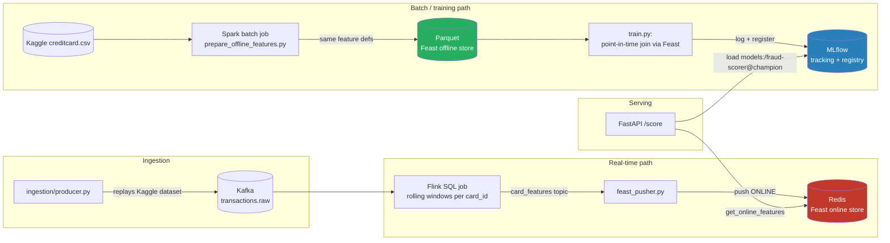

# Real-Time ML Feature Platform for Fraud Scoring

A working, runnable version of the architecture behind most production fraud-scoring
systems: transactions stream in through Kafka, Flink computes rolling behavioral features
in real time, Feast serves those same feature definitions consistently to both training
and serving, and a model trained on point-in-time-correct historical data scores
transactions in under a second through a FastAPI endpoint.

Built to close the gap between "I know what Kafka/Flink/Feast are" and "I've wired them
together and hit the failure modes." Runs entirely on free, open-source tooling via
Docker Compose — no paid cloud services required.

```
Kafka → Flink → (push) → Feast (Redis online / Parquet offline) → FastAPI
                              ↑                         ↓
                    Spark (batch features)      MLflow (registry)
```

## Why this exists

Most fraud pipelines fall into one of two categories: pure batch (nightly Spark jobs,
features that are hours stale by the time a transaction is scored) or an ad-hoc real-time
system where someone re-implements the batch feature logic in a different language for
low-latency serving — and the two implementations quietly drift apart. That drift is
**training/serving skew**, and it's one of the more expensive, hard-to-detect bug classes
in applied ML.

This project's actual point is the plumbing that prevents that: one feature definition
(`feature_repo/definitions.py`), computed by two engines (Flink for the online path, Spark
for offline/training), served through one abstraction (Feast) so both paths agree on what
"features as of this moment" means.

## Architecture



## Stack, and why each piece is here

| Component | Role | Free/local substitute used |
|---|---|---|
| **Kafka** | Event backbone for the raw transaction stream | `apache/kafka` official image, single-node KRaft mode (no ZooKeeper) |
| **Flink** | Real-time windowed feature computation | Open-source Flink cluster (jobmanager + taskmanager) via Docker |
| **Feast** | Single feature-definition contract for online + offline | Open-source Feast, Redis online store, file/Parquet offline store |
| **Spark** | Batch feature computation for training data | Open-source PySpark, `local[*]` — same code runs unmodified on Databricks/EMR |
| **MLflow** | Experiment tracking + model registry | Self-hosted MLflow server, SQLite backend |
| **FastAPI** | Sub-second scoring endpoint | — |
| **Docker Compose** | Orchestrates all of the above locally | — |

The original design referenced Databricks and AWS directly. Those cost money at any real
scale, so this repo substitutes their open-source foundations (Spark instead of managed
Databricks compute, local Kafka/Flink/Redis instead of MSK/KDA/ElastiCache). The code is
structured so that swap is mechanical: change `feature_store.yaml`'s offline/online store
config and `prepare_offline_features.py`'s Spark master, and the same feature definitions
and training/serving code run on managed infrastructure without modification. See
[Cloud deployment path](#cloud-deployment-path) below.

## A note on the data

The public [Kaggle "Credit Card Fraud Detection" dataset](https://www.kaggle.com/datasets/mlg-ulb/creditcardfraud)
(mlg-ulb/creditcardfraud) is PCA-anonymized: 28 principal components (`V1`-`V28`), `Time`,
`Amount`, and a `Class` label — no card or customer identifier. Streaming velocity
features need something to key on, so `ingestion/producer.py` and
`data/generate_sample.py` deterministically assign a synthetic `card_id` and
`merchant_category` to each row. **This is a documented simulation, not a real customer
graph** — say so plainly if you discuss this project (it's a completely standard
workaround when demoing streaming features on an anonymized public dataset, and being
upfront about it is exactly what a hiring manager will want to hear).

## Repository layout

```
ingestion/       Kafka producer — replays the dataset as a live event stream
streaming/       Flink SQL job (real-time features) + Feast pusher
feature_repo/    Feast feature definitions, config, and bootstrap
training/        Spark batch feature computation + model training (MLflow)
serving/         FastAPI scoring service
data/            Sample dataset (committed), raw/offline data (gitignored)
tests/           pytest suite — runs without Docker, Kafka, or Redis
mlflow/          Dockerfile for the MLflow tracking server
```

## Running it

**Prerequisites:** Docker Desktop (free), ~4GB RAM available to Docker. Optionally a free
[Kaggle account](https://www.kaggle.com) for the real dataset (the repo runs end to end
without one, using a small synthetic sample).

```bash
git clone <this-repo>
cd real-time-ml-feature-platform-for-fraud-scoring

# 1. Bring up Kafka, Redis, MLflow, Flink, Feast, and the API
make up
#    API docs:   http://localhost:8000/docs
#    MLflow UI:  http://localhost:5001
#    Flink UI:   http://localhost:8081

# 2. (Optional but recommended) Get the real dataset instead of the tiny sample
#    Needs a free Kaggle account -> Account Settings -> API -> Create New Token
pip install kaggle
python data/download_dataset.py

# 3. Compute offline features (Spark) and train + register a model (MLflow)
make offline-features
make train

# 4. Reload the newly trained model into the running API
curl -X POST http://localhost:8000/admin/reload

# 5. Start replaying transactions into Kafka -> Flink -> Feast, live
make demo

# 6. Score a transaction
curl -X POST http://localhost:8000/score \
  -H "Content-Type: application/json" \
  -d '{"card_id": "card_0001", "amount": 249.99, "merchant_category": "mcc_012"}'
```

Without Docker, each piece also runs directly (`pip install -r requirements.txt`, see
each subfolder's own `requirements.txt` for its minimal dependency set, and `.env.example`
for the environment variables to export).

## Running the tests

```bash
pip install -r requirements.txt
pytest tests/ -v
```

The suite (13 tests) validates the Feast feature definitions (apply, push, online read,
point-in-time historical read), the Spark rolling-window feature logic on synthetic data,
the producer's enrichment/serialization functions, and the FastAPI contract — all without
Docker, Kafka, or Redis running. CI (`.github/workflows/ci.yml`) runs this suite plus a
Docker image build check on every push.

## The feature freshness / completeness trade-off

This is the part of the original project description called out as "in progress," and
it's worth being specific about rather than hand-waving:

Flink's windowed aggregation (`streaming/flink_feature_job.py`) uses a watermark
(`MAX_OUT_OF_ORDERNESS`, default 5 seconds) to decide when a window is "done" and safe to
emit. Raise it and features are more complete (a late-arriving event still gets counted in
its window) but staler; lower it and features are fresher but a delayed producer retry or
clock-skewed event can silently miss its window. There's no universally correct value —
it's a trade-off tuned against your actual event-arrival distribution (p99 lateness) and
your fraud model's actual sensitivity to a missed count.

A second, related gap: the online path (Flink, real time) and offline path (Spark, batch)
are two independent implementations of the same feature logic, kept consistent only by
convention (both read `feature_repo/definitions.py`'s docstring and must match its window
definitions by hand). A more mature version of this platform would either (a) run the
same Flink job in a bounded/batch execution mode against historical data for training
features too, or (b) adopt a framework (e.g. Chronon, or Feast's newer on-demand transform
support) that compiles one feature definition into both the streaming and batch execution
plans, removing the "two implementations that must agree" problem entirely.

## Cloud deployment path

Nothing here is architecturally locked to local Docker:

- **Kafka** → Amazon MSK (drop-in — same Kafka protocol)
- **Flink** → Amazon Kinesis Data Analytics or a self-managed Flink cluster on EKS
- **Redis (Feast online store)** → Amazon ElastiCache for Redis, or DynamoDB with Feast's
  DynamoDB online store connector
- **Parquet (Feast offline store)** → S3, with Feast's offline store config pointed at
  `s3://...` paths
- **Spark (`prepare_offline_features.py`)** → runs unmodified on Databricks or EMR; only
  `SparkSession.builder.master(...)` changes
- **MLflow** → point `MLFLOW_TRACKING_URI` at a hosted MLflow server (e.g. on ECS/EKS) or
  a managed offering
- **FastAPI** → any container platform (ECS Fargate, EKS, App Runner)

## License

MIT — see [LICENSE](LICENSE).
